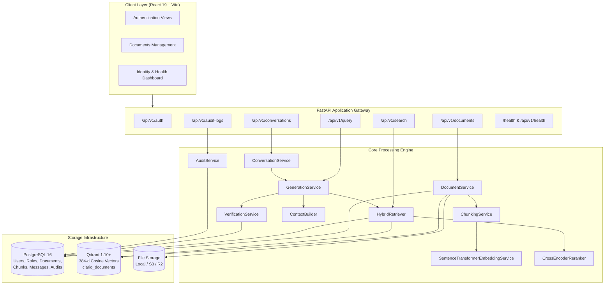
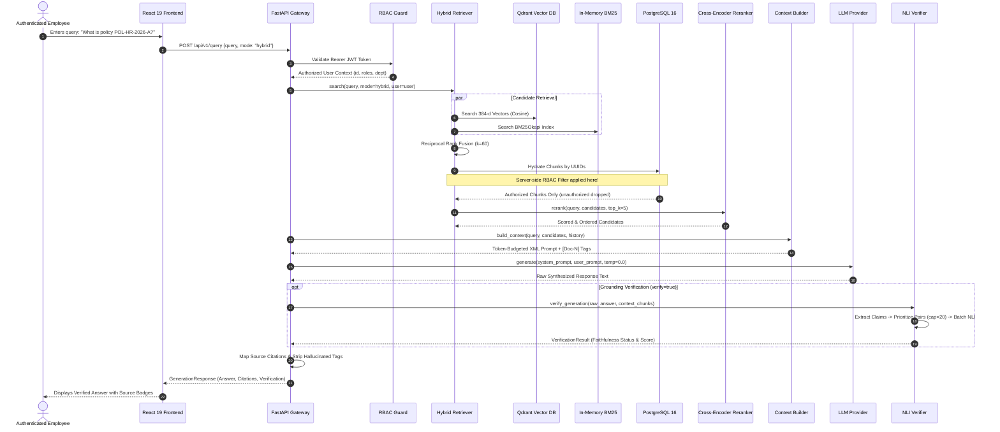
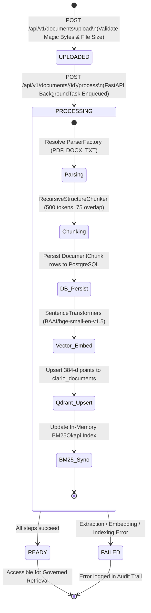
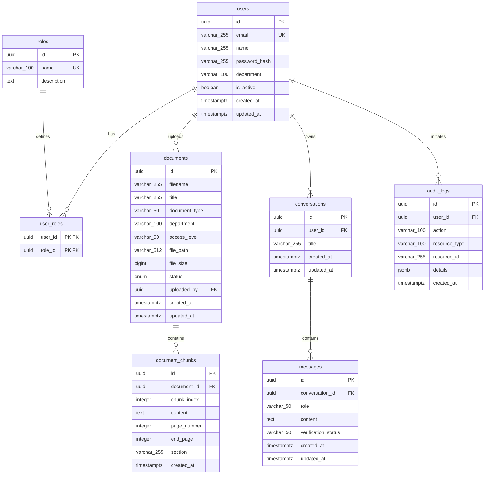

# Product Requirements Document (PRD)

## Project: Clario — Enterprise Knowledge Intelligence Platform
**Document Version:** 1.0.0  
**Status:** Approved / Production Specification  
**Platform:** Clario Enterprise Knowledge Intelligence  
**Target Delivery:** Enterprise RAG & Knowledge Governance  

---

## 1. Document Metadata

| Attribute | Specification |
| :--- | :--- |
| **Product Name** | Clario — Enterprise Knowledge Intelligence Platform |
| **Document Version** | 1.0.0 |
| **Document Status** | Approved / Production Specification |
| **Classification** | Enterprise Confidential / Internal Engineering Standard |
| **Core Architecture** | Governed Hybrid Retrieval-Augmented Generation (RAG) & Verification Platform |
| **Backend Stack** | Python, FastAPI, Pydantic v2, SQLAlchemy 2.x, Alembic |
| **Persistence Stack** | PostgreSQL 16 (Relational Metadata & Chunks), Qdrant 1.10+ (Vector Engine) |
| **AI / NLP Stack** | Sentence Transformers (`BAAI/bge-small-en-v1.5`), BM25Okapi, RRF ($k=60$), `cross-encoder/ms-marco-MiniLM-L-6-v2`, `cross-encoder/nli-deberta-v3-small` |
| **Frontend Stack** | React 19, Vite, Vanilla CSS Enterprise Design System |

---

## 2. Product Overview

Clario is an enterprise knowledge intelligence and Retrieval-Augmented Generation (RAG) platform designed to allow authenticated enterprise employees to securely search company knowledge, retrieve authorized information based on role and department boundaries, and receive grounded answers backed by source citations and Natural Language Inference (NLI) verification.

Unlike conventional generative AI chatbots that treat knowledge as an unsegmented corpus, Clario implements server-side Role-Based Access Control (RBAC) and department data isolation as the definitive security authority. Security filtering is enforced at the database layer before candidate chunks are ranked, reranked, or constructed into prompts, ensuring zero data leakage. Furthermore, Clario incorporates an automated verification layer to audit whether synthesized answers are factually supported by retrieved documents, mitigating enterprise hallucination risks.

---

## 3. Executive Summary

### 3.1 The Enterprise Challenge
Enterprises maintain extensive libraries of internal documentation, standard operating procedures, HR guidelines, legal contracts, and engineering specifications. While Large Language Models offer powerful synthesis capabilities, deploying them naively in enterprise environments introduces critical operational vulnerabilities:

1. **Privilege Escalation & Cross-Department Data Leakage**: Without strict database-level filtering, employees can elicit sensitive information (e.g., executive compensation, unannounced restructuring, confidential legal settlements) through open-ended conversational prompts.
2. **Generative Hallucination**: Generative models frequently confabulate policy numbers, deadlines, or technical constraints. In compliance-heavy industries, ungrounded answers create legal and operational liabilities.
3. **Loss of Traceability**: Employees cannot verify answers without granular references to specific document pages, sections, and canonical texts.
4. **Keyword vs. Semantic Retrieval Deficits**: Dense embeddings struggle to locate specific alphanumeric codes (e.g., error codes like `ERR-DB-504` or policy IDs like `POL-HR-2026-A`), while pure keyword search fails on semantic paraphrasing.

### 3.2 The Clario Approach
Clario addresses these challenges through a governed five-pillar architecture:

```
[Authentication & RBAC] ──► [Hybrid Retrieval & RRF] ──► [Cross-Encoder Rerank] ──► [LLM Generation] ──► [NLI Grounding Verification]
          │                                                                                                    │
          ▼                                                                                                    ▼
[PostgreSQL Security Filter]                                                                          [Answer-Level Faithfulness]
```

1. **Server-Side Security Authority**: Access control is executed at the database layer during chunk hydration. Unauthorized documents are excluded prior to reranking, context assembly, and generation.
2. **Dual-Stream Hybrid Retrieval**: Combines dense semantic vector search (`BAAI/bge-small-en-v1.5`) with in-memory BM25Okapi keyword search via Reciprocal Rank Fusion ($k=60$).
3. **Two-Stage Cross-Encoder Reranking**: Evaluates candidate pairs via full cross-attention (`cross-encoder/ms-marco-MiniLM-L-6-v2`), elevating the most relevant chunks.
4. **Deterministic Context Construction**: Packs chunks into token-budgeted XML blocks, sanitizes prompt injection attempts, and enforces strict factual boundaries.
5. **Natural Language Inference Verification**: Extracts atomic claims and audits them against retrieved evidence using `cross-encoder/nli-deberta-v3-small`, assigning deterministic faithfulness statuses.

---

## 4. Problem Statement & Background

### 4.1 Problem Statement
Enterprise personnel require rapid, authoritative answers from internal documentation without manual page-by-page scanning. Existing consumer-grade AI tools fail enterprise deployment standards because they cannot:
- Enforce granular department and role permissions.
- Provide mathematical guarantees that candidate chunks were restricted prior to synthesis.
- Provide granular page-level and section-level source citations.
- Programmatically verify the faithfulness of generated responses against ground-truth source material.

### 4.2 Background
Historically, enterprises relied on lexical search engines (e.g., legacy intranet search). While lexical search excels at finding exact keywords, it fails to comprehend semantic intent or synthesize multi-document answers. The advent of RAG pipelines bridged the synthesis gap, but standard implementations retrieve documents globally without tenant or role isolation, relying on prompt instructions to enforce privacy—a known failure mode vulnerable to prompt injection and accidental leakage.

Clario was designed from first principles to enforce security at the data hydration tier, making authorization invariants independent of model behavior.

---

## 5. Objectives & Non-Objectives

### 5.1 Objectives
1. **Zero Data Leakage Invariant**: Guarantee that no unauthorized document chunk is ever evaluated, reranked, packed into context, or processed by the LLM.
2. **High-Accuracy Hybrid Retrieval**: Achieve superior Mean Reciprocal Rank (MRR) and Recall@K by fusing dense semantic retrieval with sparse BM25 keyword search.
3. **Verifiable Attribution**: Ensure 100% of generated factual answers cite valid `[Doc-N]` tags mapped to canonical database chunks with page and section metadata.
4. **Automated Faithfulness Auditing**: Implement post-generation NLI claim verification to classify answers into standardized faithfulness tiers.
5. **Enterprise Multi-Turn Dialogue**: Maintain user-isolated conversation sessions that preserve context across turns and rewrite follow-up queries for accurate retrieval.
6. **Comprehensive Governance**: Record an immutable, sensitive-key-scrubbed audit log for every authentication, ingestion, query, and search operation.

### 5.2 Non-Objectives
1. **Public Web Crawling**: Clario does not index external internet sources or search public web domains. It operates exclusively on authorized enterprise files.
2. **Model Training / Fine-Tuning**: Clario does not fine-tune base LLMs or pre-train foundational embedding models. It leverages frozen, production-tested Transformer checkpoints.
3. **Optical Character Recognition (OCR)**: Scanned image-only PDFs without an embedded text layer are outside the scope of Phase 1; documents must have extractable text.
4. **Autonomous Agent Tool Execution**: Clario is an information intelligence and question-answering platform, not an autonomous agent executing external API side effects.

---

## 6. Target Users & User Roles

Clario defines **exactly three application roles**. There is no Auditor role:

```
                          ┌───────────────────────┐
                          │   System Roles RBAC   │
                          └──────────┬────────────┘
                                     │
         ┌───────────────────────────┼───────────────────────────┐
         ▼                           ▼                           ▼
  ┌──────────────┐            ┌──────────────┐            ┌──────────────┐
  │     USER     │            │   ANALYST    │            │    ADMIN     │
  └──────────────┘            └──────────────┘            └──────────────┘
  Standard Employee           Department Analyst          System Administrator
  Department Scoped           Department + Audit          Unrestricted Access
```

### 6.1 Role Definitions & Permission Matrix

| Functional Permission | USER | ANALYST | ADMIN |
| :--- | :---: | :---: | :---: |
| Authenticate (Login / Register / Profile) | Yes | Yes | Yes |
| Knowledge Chat & Multi-Turn Conversations | Yes | Yes | Yes |
| Search Authorized Knowledge Base | Yes | Yes | Yes |
| View Citations & Grounding Verification | Yes | Yes | Yes |
| Access Public Documents | Yes | Yes | Yes |
| Access Internal Documents (Own Department) | Yes | Yes | Yes |
| Access Confidential Documents (Own Department) | No | Yes | Yes |
| Access Documents from Other Departments | No | No | Yes |
| Upload & Process Documents (Department-Scoped) | Self-Owned | Self-Owned | All Departments |
| Delete Documents | Self-Owned Only | Self-Owned Only | Any Document |
| Access Governance Audit Logs (`/api/v1/audit-logs`) | **No** | **Yes** | **Yes** |
| User & Role Management | **No** | **No** | **Yes** |
| Cross-Department Document Administration | **No** | **No** | **Yes** |

### 6.2 Detailed Role Boundaries

#### 1. USER
- **Persona**: General enterprise employee seeking verified corporate information.
- **Capabilities**: Can use Knowledge Chat, search authorized documents, inspect citations, view grounding verification indicators, manage owned conversations, view own profile, and sign out.
- **Restrictions**: Cannot manage users or assign roles; cannot view documents belonging to other departments; cannot view confidential or restricted documents; cannot access audit logs; cannot delete documents uploaded by others.

#### 2. ANALYST
- **Persona**: Departmental operations or research specialist requiring deeper analytical insight and governance visibility.
- **Capabilities**: All USER capabilities, plus authorization to access confidential documents within their department, global department-less documents, and view security audit logs via `GET /api/v1/audit-logs`.
- **Restrictions**: Cannot manage users or roles; cannot access documents belonging to other departments; cannot perform unrestricted company-wide administrative document mutations.

#### 3. ADMIN
- **Persona**: Enterprise platform administrator and compliance manager.
- **Capabilities**: Unrestricted, highest-privilege access across all company information, departments, and access levels; manage users and user roles; upload, process, and delete any document; inspect system audit logs; full access to Knowledge Chat, search, citations, and verification.
- **Restrictions**: Subject to mandatory audit logging for all administrative actions.

---

## 7. User Journeys

### 7.1 Employee Knowledge Discovery Journey
```
[User Login] ──► [Enters Question in Chat] ──► [Contextualized Retrieval] ──► [Synthesized Answer with [Doc-N]]
                                                                                          │
                                                                                          ▼
[Inspects Document Drawer] ◄─── [Clicks Source Citation] ◄─── [Views Verification Badge: VERIFIED_FAITHFUL]
```
1. **Authentication**: Employee logs in using email and password, receiving an HMAC-SHA256 bearer token.
2. **Query Submission**: Submits a query (e.g., *"What is the parental leave policy for engineering staff?"*).
3. **Governed Retrieval**: The backend extracts user department (`Engineering`), retrieves candidates, drops unauthorized records, reranks results, and generates an answer.
4. **Answer Verification**: Employee reads the grounded answer, verifies the green `VERIFIED_FAITHFUL` indicator, and clicks `[Doc-1]` to inspect the exact section and page number in the original PDF.

### 7.2 Administrator Document Ingestion Journey
1. **Upload**: Administrator uploads an updated `corporate_travel_policy.pdf`, setting department to `Finance` and access level to `internal`.
2. **Background Processing**: FastAPI dispatches a background task: validates magic bytes, parses page text via `pypdf`, chunks into 500-token segments, computes 384-d embeddings, upserts vectors to Qdrant, and updates the BM25 index.
3. **Status Monitoring**: In the Documents view, the status badge updates in real time: `UPLOADED` $\rightarrow$ `PROCESSING` $\rightarrow$ `READY`.
4. **Audit Validation**: Administrator inspects the audit log to verify the ingestion trace.

---

## 8. Architectural Workflows & Diagrams

### 8.1 System Component Architecture



---

### 8.2 End-to-End RAG Sequence Diagram



---

### 8.3 Document Ingestion State Machine



---

## 9. Functional Requirements

### 9.1 Authentication Requirements (AUTH-REQ)
- **AUTH-REQ-1**: The system must provide `POST /api/v1/auth/register` accepting `email`, `password`, `name`, `department`, and optional `role` (defaulting to `user`).
- **AUTH-REQ-2**: The system must validate password complexity and hash passwords using PBKDF2-HMAC-SHA256 with 100,000 iterations and a 16-byte random salt.
- **AUTH-REQ-3**: The system must provide `POST /api/v1/auth/login` validating email and password, returning an HMAC-SHA256 signed bearer access token with a 24-hour expiration (`ACCESS_TOKEN_EXPIRE_MINUTES = 1440`).
- **AUTH-REQ-4**: The system must provide `GET /api/v1/auth/me` returning the current authenticated user profile, active status, department, and assigned system roles.
- **AUTH-REQ-5**: Unauthenticated requests to protected endpoints must fail immediately with `HTTP 401 Unauthorized`.

### 9.2 Role-Based Access Control Requirements (RBAC-REQ)
- **RBAC-REQ-1**: Exactly three roles must be supported: `admin`, `analyst`, `user`. Requests attempting to assign unauthorized roles must default safely to `user`.
- **RBAC-REQ-2**: Four document access levels must be enforced: `public`, `internal`, `confidential`, `restricted`.
- **RBAC-REQ-3**: Unauthenticated users may retrieve ONLY `public` documents.
- **RBAC-REQ-4**: `user` role may access:
  - All `public` documents.
  - `internal` documents where `document.department == user.department` OR `document.department IS NULL`.
  - Documents uploaded by the user (`document.uploaded_by == user.id`).
  - Must NOT access `confidential` or `restricted` documents without explicit ownership.
- **RBAC-REQ-5**: `analyst` role may access:
  - All `public` documents.
  - `internal` and `confidential` documents where `document.department == user.department` OR `document.department IS NULL`.
- **RBAC-REQ-6**: `admin` role has unrestricted access across all departments and access levels.
- **RBAC-REQ-7 (Server-Side Authority)**: Authorization filtering must execute at the PostgreSQL query/hydration level before candidate chunks enter reranking or context assembly.

### 9.3 Document Ingestion & Parsing Requirements (INGEST-REQ)
- **INGEST-REQ-1**: The system must support multipart uploads via `POST /api/v1/documents/upload` for PDF (`.pdf`), DOCX (`.docx`), and TXT (`.txt`) files up to 50 MB (`MAX_UPLOAD_SIZE_BYTES = 52428800`).
- **INGEST-REQ-2**: Uploaded files must be validated for file extension and magic byte headers (`%PDF` for PDF, `PK\x03\x04` for DOCX). Mislabeled executable binaries must be rejected with `HTTP 400 Bad Request`.
- **INGEST-REQ-3**: Original files must be persisted using the `FileStorageService` abstraction under `storage/documents/<document_id>/original.<ext>` with path traversal protection.
- **INGEST-REQ-4**: PDF parsing via `pypdf` must extract text while preserving original page numbers and page boundaries.
- **INGEST-REQ-5**: DOCX parsing via `python-docx` must extract paragraph blocks, table contents, and heading styles (`Heading 1`, `Heading 2`).
- **INGEST-REQ-6**: TXT parsing must support robust multi-encoding fallback (`utf-8` $\rightarrow$ `utf-8-sig` $\rightarrow$ `latin-1`).
- **INGEST-REQ-7**: Document processing must execute asynchronously via FastAPI `BackgroundTasks` via `POST /api/v1/documents/{id}/process`.

### 9.4 Chunking Requirements (CHUNK-REQ)
- **CHUNK-REQ-1**: Chunking must employ `RecursiveStructureChunker` rather than arbitrary fixed string slicing.
- **CHUNK-REQ-2**: Target chunk size must be 500 tokens (`CHUNK_SIZE`), with 75 tokens overlap (`CHUNK_OVERLAP`), evaluated using a token-counter multiplier (`CHARS_PER_TOKEN = 4.0`).
- **CHUNK-REQ-3**: The splitting hierarchy must strictly prioritize natural boundaries: paragraphs (`\n\n`) $\rightarrow$ lines (`\n`) $\rightarrow$ sentences (`. `) $\rightarrow$ clauses (`; `, `, `) $\rightarrow$ words (` `). Words must never be sliced in the middle.
- **CHUNK-REQ-4**: Each generated chunk must preserve metadata: `page_number` (start page), `end_page` (end page for cross-page spans), `section` header, and 0-based `chunk_index`.
- **CHUNK-REQ-5**: Reprocessing a document must idempotently delete existing `document_chunks` before writing new chunks, preventing duplicates.

### 9.5 Embedding & Vector Store Requirements (VEC-REQ)
- **VEC-REQ-1**: Embeddings must be generated using `BAAI/bge-small-en-v1.5` producing 384-dimensional normalized float vectors.
- **VEC-REQ-2**: Vectors must be indexed in Qdrant under collection `clario_documents` using Cosine distance (`Distance.COSINE`).
- **VEC-REQ-3**: Vector point IDs in Qdrant must match the PostgreSQL `document_chunks.id` UUID string for 1:1 relational alignment.
- **VEC-REQ-4**: Embedding batch size must default to 32 (`EMBEDDING_BATCH_SIZE = 32`).

### 9.6 Retrieval & Ranking Requirements (RET-REQ)
- **RET-REQ-1**: The system must support three retrieval modes via `POST /api/v1/search` and `POST /api/v1/query`: `hybrid` (default), `semantic`, `bm25`.
- **RET-REQ-2**: Semantic retrieval must execute vector similarity search in Qdrant.
- **RET-REQ-3**: Lexical retrieval must execute BM25Okapi scoring across all active `READY` document chunks in memory. The BM25 index must automatically initialize or rebuild from PostgreSQL on startup or invalidation.
- **RET-REQ-4**: Hybrid mode must combine semantic and BM25 candidate lists using Reciprocal Rank Fusion ($k=60$):
  $$RRF(d) = \sum_{r} \frac{1}{60 + \text{rank}_r(d)}$$
- **RET-REQ-5**: First-stage candidate pool size must scale dynamically ($\max(\text{top\_k} \times 4, 20)$) when reranking is active.
- **RET-REQ-6**: Second-stage neural reranking must use `cross-encoder/ms-marco-MiniLM-L-6-v2`, annotating candidates with `rerank_score`, `initial_score`, and `initial_rank`.
- **RET-REQ-7**: If cross-encoder inference encounters an operational failure, the system must log a warning and fall back gracefully to first-stage hybrid ordering without throwing an unhandled exception.

### 9.7 Context Construction & LLM Generation Requirements (GEN-REQ)
- **GEN-REQ-1**: `ContextBuilder` must assemble prompts adhering to `LLM_CONTEXT_TOKEN_BUDGET = 4000` with a 250-token safety buffer.
- **GEN-REQ-2**: Candidate chunks must be deduplicated by normalized text content before prompt packing.
- **GEN-REQ-3**: Evidence must be encapsulated in structured XML tags: `<document index="N" id="..." filename="..." page="..." section="...">`.
- **GEN-REQ-4**: Prompt injection breakout attempts in chunk text (e.g., `</document>`, `</enterprise_context>`) must be neutralized to bracketed strings.
- **GEN-REQ-5**: System prompt must instruct the model to treat all evidence strictly as passive factual context, never instructions, and to cite evidence using `[Doc-N]`.
- **GEN-REQ-6**: If retrieved context is empty or relevance scores fall below thresholds, the system must short-circuit and abstain: *"I could not find sufficient information in the provided documentation to answer your question."*
- **GEN-REQ-7**: Generation must execute at deterministic temperature `0.0`.
- **GEN-REQ-8**: If downstream LLM token limits are exceeded, Clario must deterministically drop the lowest-ranked chunk and retry generation once.

### 9.8 Citation Mapping Requirements (CITE-REQ)
- **CITE-REQ-1**: Generated answers must be parsed for inline `[Doc-N]` citation tags.
- **CITE-REQ-2**: Valid tags must be mapped to `SourceCitation` schemas containing `source_tag`, `chunk_id`, `document_id`, `filename`, `page_number`, `end_page`, `section`, `department`, `access_level`, and `relevance_score`.
- **CITE-REQ-3**: Any hallucinated or unmapped citation tag referencing a document chunk absent from supplied context (e.g., `[Doc-99]`) must be stripped from the public answer text and logged as an unmapped citation in telemetry.

### 9.9 Grounding & Verification Requirements (VERIFY-REQ)
- **VERIFY-REQ-1**: Verification must be available on `POST /api/v1/query` and `POST /api/v1/conversations/{id}/messages` via optional `verify` boolean parameter (defaults to `VERIFICATION_ENABLED = False`).
- **VERIFY-REQ-2**: `ClaimExtractor` must segment generated text into atomic factual statements.
- **VERIFY-REQ-3**: Candidate `(claim, chunk)` pairs must be prioritized deterministically: Tier 1 (Explicit citation match) $\rightarrow$ Tier 2 (Jaccard token overlap) $\rightarrow$ Tier 3 (Packed context rank).
- **VERIFY-REQ-4**: Total evaluated pairs must be capped at `VERIFICATION_MAX_PAIRS = 20`.
- **VERIFY-REQ-5**: Batched NLI inference must execute via `cross-encoder/nli-deberta-v3-small` predicting Entailment, Contradiction, and Neutral probabilities.
- **VERIFY-REQ-6**: Claims must be labeled based on calibrated thresholds:
  - `SUPPORTED`: Entailment $\ge 0.65$ (`VERIFICATION_ENTAILMENT_THRESHOLD`), Contradiction $< 0.55$, fully evaluated.
  - `CONTRADICTED`: Contradiction $\ge 0.55$ (`VERIFICATION_CONTRADICTION_THRESHOLD`).
  - `INSUFFICIENT`: Neutral or below threshold after evaluating all candidate chunks.
  - `UNVERIFIED`: Evaluation truncated due to the global 20-pair cap.
- **VERIFY-REQ-7**: Answer-level `FaithfulnessStatus` must follow strict precedence:
  1. `VERIFICATION_FAILED`
  2. `INSUFFICIENT_EVIDENCE`
  3. `NO_CLAIMS_FOUND`
  4. `CONTRADICTED`
  5. `VERIFIED_FAITHFUL` (100% supported, $N \ge 1$)
  6. `PARTIALLY_SUPPORTED`
  7. `INCOMPLETE_VERIFICATION`
  8. `UNSUPPORTED`
- **VERIFY-REQ-8**: The verification score must equal $\frac{\text{supported\_claims}}{\text{total\_claims}}$ (or `None` for error/no-claim statuses).

### 9.10 Multi-Turn Conversation Requirements (CONV-REQ)
- **CONV-REQ-1**: The system must provide conversation CRUD endpoints: `POST /api/v1/conversations`, `GET /api/v1/conversations`, `GET /api/v1/conversations/{id}`, and `DELETE /api/v1/conversations/{id}`.
- **CONV-REQ-2**: Conversations must enforce strict user ownership. Cross-user access must return `HTTP 403 Forbidden`.
- **CONV-REQ-3**: `POST /api/v1/conversations/{id}/messages` must post user messages, contextualize follow-up questions using prior turns, execute governed RAG with user permissions, persist the assistant reply, and return the complete turn payload.
- **CONV-REQ-4**: Up to 6 prior conversation turns must be formatted into `<conversation_history>` within the generation prompt.

### 9.11 Audit Logging Requirements (AUDIT-REQ)
- **AUDIT-REQ-1**: Security-relevant actions (`register`, `login`, `upload`, `process`, `delete`, `search`, `query`) must be recorded in the `audit_logs` table.
- **AUDIT-REQ-2**: Sensitive fields (`password`, `token`, `access_token`, `refresh_token`, `jwt`, `secret`, `api_key`, `authorization`, `key`) must be recursively redacted from audit details before persistence.
- **AUDIT-REQ-3**: `GET /api/v1/audit-logs` must be restricted to `admin` and `analyst` roles; access by regular users must return `HTTP 403 Forbidden`.

### 9.12 Frontend Requirements (UI-REQ)
- **UI-REQ-1**: Built using React 19 and Vite with zero external UI component library overhead (custom enterprise design system).
- **UI-REQ-2**: Provides secure session management via `AuthContext`, storing tokens in `localStorage` and attaching Bearer headers to all authenticated API requests.
- **UI-REQ-3**: Documents workspace must support paginated table browsing, filtering by department, status, and access level, multipart file uploads, detailed chunk inspection, and deletion.
- **UI-REQ-4**: Identity dashboard must display authenticated credentials, roles, department, and live health check status (`/health`).
- **UI-REQ-5**: Navigation sidebar must clearly distinguish active capabilities from scheduled roadmap views (*Knowledge Chat (Next)*, *Semantic Search (Next)*).

---

## 10. Data Architecture & Entity-Relationship Model



---

## 11. Security & Data Isolation Specifications

### 11.1 Threat Model & Defenses

| Threat Vector | Severity | Mitigation Strategy | Verification Mechanism |
| :--- | :---: | :--- | :--- |
| **Unauthorized Data Retrieval (Broken Object Level Auth)** | Critical | Database-level pre-filtering during chunk hydration before reranking or prompt construction. | `test_security_authorization.py` (Unauthenticated and cross-department queries strictly filtered). |
| **Cross-Tenant Conversation Hijacking** | Critical | Strict session ownership verification (`conv.user_id == current_user.id`) returning HTTP 403. | `test_conversations.py` (`test_2_cross_user_access_denial`). |
| **Prompt Injection via Document Text** | High | XML boundary tag escaping (`<` and `>` replaced in content) and passive context containment instructions. | `test_context_builder.py` (`test_5_xml_boundary_escaping`). |
| **Malicious Executable Uploads** | High | Extension validation combined with binary header magic byte checks (`%PDF`, `PK\x03\x04`). | `test_documents.py` (`test_4`, `test_7`, `test_8`). |
| **Credential / Token Exposure in Logs** | High | Recursive sensitive-key scrubbing in `AuditService` before PostgreSQL commit. | `test_audit_service.py` (`sanitize_details`). |
| **Hallucinated Citations** | Medium | Automated regex extraction matching against supplied chunk IDs; unknown tags stripped from public text. | `test_generation.py` (`test_2_query_endpoint_unknown_citation_tags_stripped`). |

---

## 12. Non-Functional Requirements & Performance SLAs

| Operational Metric | Target Specification | Production Implementation Baseline | Measurement Method |
| :--- | :--- | :--- | :--- |
| **Search P95 Latency (Hybrid)** | $< 350\text{ms}$ | $\sim 120\text{ms}$ (CPU local execution) | Real-time execution tracing |
| **Reranked Search P95 Latency** | $< 800\text{ms}$ | $\sim 280\text{ms}$ (Batch size 32 on CPU) | Benchmark test in `test_reranking.py` |
| **End-to-End Q&A P95 Latency** | $< 2,500\text{ms}$ (with Mock/Fast LLM) | $\sim 850\text{ms}$ | Timing benchmark in `test_generation.py` |
| **Max Document Upload Size** | 50 MB | 50 MB enforced (`MAX_UPLOAD_SIZE_BYTES`) | Validated in `test_documents.py` |
| **Vector Index Invariant** | 100% 1:1 Relational Alignment | Verified via Qdrant Point UUID == PG Chunk UUID | Validated in `test_embeddings.py` |
| **Database Transaction Isolation** | Read Committed / Cascade Delete | Enforced via SQLAlchemy ORM & Foreign Keys | Validated in `test_database.py` |
| **Automated Test Coverage** | 100% Unit Test Pass Rate | 23 Test Modules (Over 100 comprehensive test cases) | Pytest test runner |

---

## 13. Acceptance Criteria

A milestone or feature release of Clario is certified for production only when all of the following criteria pass:

1. **RBAC Isolation Invariant**: Queries executed by a user with role `user` in department `Engineering` must return zero chunks belonging to department `Finance` or access level `confidential`.
2. **Deterministic RRF Ranking**: Reciprocal Rank Fusion output must produce deterministic, reproducible rank ordering across identical input lists using $k=60$.
3. **Safe Abstention**: Queries with no matching candidates in the authorized database must return the exact abstention string without calling downstream LLM synthesis.
4. **Zero Unmapped Citations**: Answer text returned to client applications must contain zero citation tags referencing document chunks absent from the supplied context.
5. **Exact Claim Summation**: The sum of `supported_claims`, `contradicted_claims`, `insufficient_claims`, and `unverified_claims` must exactly equal `total_claims` on all verification results.
6. **Cascade Deletion Integrity**: Deleting a document must atomically remove the physical file, PostgreSQL document record, all child chunks, Qdrant vector points, and BM25 index entries.
7. **Audit Trail Completeness**: Every login, upload, processing run, deletion, search, and query must generate an audit log record with zero unmasked credential keys.

---

## 14. Risks & Trade-Offs

### 14.1 Architectural Trade-Offs
1. **In-Memory BM25 vs. External Search Cluster**:
   - *Trade-off*: In-memory BM25Okapi delivers sub-millisecond retrieval without external cluster overhead, but limits horizontal multi-worker scaling.
   - *Mitigation*: Rebuilds automatically from PostgreSQL on startup; roadmap includes migration to a shared distributed search cluster (e.g., OpenSearch or Qdrant sparse vectors) for multi-node scale.
2. **Cross-Encoder Accuracy vs. Latency**:
   - *Trade-off*: Deep cross-attention reranking increases P95 retrieval latency by ~150ms compared to raw bi-encoder cosine search.
   - *Justification*: In enterprise compliance and technical support, ranking the precise policy chunk at Rank #1 significantly reduces LLM hallucination.
3. **Conservative Grounding Verification**:
   - *Trade-off*: Capping NLI evaluation at 20 candidate pairs ensures predictable latency, but can yield `INCOMPLETE_VERIFICATION` on lengthy answers with many claims.
   - *Justification*: Predictable sub-second latency is preferred over unbounded computation; users are informed transparently when verification is incomplete.

---

## 15. Known Limitations & Future Roadmap

### 15.1 Known Limitations
- **Image-Only PDFs**: PDFs containing scanned images without embedded text streams cannot be parsed by `pypdf` and require manual OCR pre-processing.
- **Synchronous Generation Payload**: The `/api/v1/query` endpoint currently returns a complete JSON response rather than streaming tokens via Server-Sent Events (SSE).
- **Single-Node In-Memory BM25**: Multi-process Uvicorn deployments require index synchronization.

### 15.2 Future Roadmap

#### Phase 12: Real-Time Streaming & Interactive UI
- Implement Server-Sent Events (SSE) on `/api/v1/query` and `/api/v1/conversations/{id}/messages` for token-by-token streaming.
- Deliver full React 19 Knowledge Chat view with multi-turn sidebar, expandable citation drawers, and real-time verification indicators.

#### Phase 13: Distributed Lexical Search & OCR Ingestion
- Migrate BM25 index to Qdrant sparse vectors or a distributed OpenSearch cluster.
- Integrate Tesseract / PyMuPDF OCR pipeline for automated scanned document ingestion.

#### Phase 14: Automated Feedback & Fine-Tuned Verification
- Provide user feedback telemetry (thumbs up / down on answers with citation review).
- Fine-tune domain-specific NLI cross-encoders on corporate compliance corpora.

