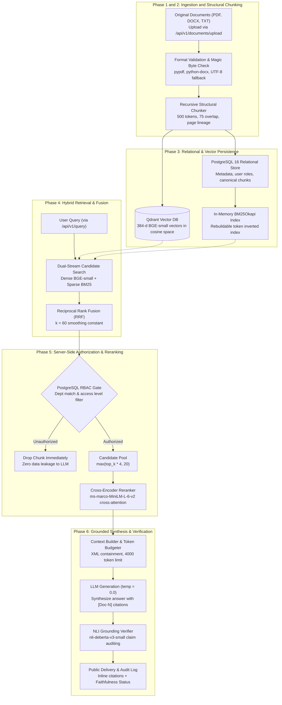

# Clario — Enterprise Knowledge Intelligence Platform

[](https://www.python.org/)
[](https://fastapi.tiangolo.com/)
[](https://react.dev/)
[](https://www.postgresql.org/)
[](https://qdrant.tech/)
[](https://huggingface.co/BAAI/bge-small-en-v1.5)

Clario is an enterprise knowledge intelligence and Retrieval-Augmented Generation (RAG) platform that allows authenticated employees to search company knowledge, retrieve authorized information governed by role and department boundaries, and receive grounded answers backed by source citations and Natural Language Inference (NLI) verification. The system is evaluated across 6 ground-truth Information Retrieval archetypes and 8 NLI faithfulness archetypes against internal policies, technical specifications, and corporate guidelines.

---

## Design and Strengths

### System Workflow
The platform executes governed knowledge synthesis through a six-phase architecture orchestrated by FastAPI and PostgreSQL:



The six execution phases operate as follows:
1. Multi-Format Ingestion and Validation: Ingests PDF, DOCX, and TXT files, validates binary magic bytes (`%PDF`, `PK\x03\x04`), sanitizes paths, and stores originals in `storage/documents/<uuid>/original.<ext>`.
2. Structural Recursive Chunking: Chunks text along natural linguistic boundaries (`\n\n` $\rightarrow$ `\n` $\rightarrow$ `. ` $\rightarrow$ `; ` $\rightarrow$ `, ` $\rightarrow$ ` `) targeting 500 tokens with 75-token overlap, preserving start page, end page, and section headers without slicing words.
3. Dual Persistence: Commits canonical chunk text and metadata to PostgreSQL 16 (`document_chunks` table), batch-generates 384-d normalized embeddings via `BAAI/bge-small-en-v1.5`, upserts points to Qdrant (`clario_documents`), and synchronizes the in-memory BM25 index.
4. Dual-Stream Hybrid Retrieval: Queries dense semantic vectors in Qdrant and sparse lexical tokens in BM25Okapi simultaneously, fusing rankings deterministically using Reciprocal Rank Fusion ($k=60$).
5. Server-Side Security Gating & Reranking: Filters candidates against authenticated user roles and department boundaries at the database hydration tier *before* reranking. Authorized candidates are re-scored via `cross-encoder/ms-marco-MiniLM-L-6-v2`.
6. Grounded Reply Synthesis & Verification: Packs top reranked chunks into token-budgeted XML blocks, synthesizes responses via an OpenAI-compatible provider at temperature 0.0, audits claims via `cross-encoder/nli-deberta-v3-small`, maps citations, and commits structured audit logs.

### Safety-First Routing & Server-Side Security Authority
The platform enforces security at the data hydration tier rather than treating the frontend or prompt instructions as security boundaries. In `hybrid_retriever.py` and `document_service.py`, access is enforced before candidate pooling:
- Three Application Roles: Exactly three roles exist: `user`, `analyst`, `admin`. There is no Auditor role.
  1. `user`: Accesses `public` documents, `internal` documents matching their department, and self-uploaded documents. Cannot access confidential documents or audit logs.
  2. `analyst`: Accesses `public`, `internal`, and `confidential` documents within their department, global department-less documents, and audit logs. Cannot manage users.
  3. `admin`: Unrestricted access across all company documents, departments, user roles, and audit trails.
- Server-Side Pre-Filtering: Unauthorized chunks are dropped during PostgreSQL hydration. They never appear in the candidate pool, never receive a rerank score, and never enter LLM prompts.

### Zero Data Leakage Invariant Test
Automated security unit tests in [tests/test_security_authorization.py](file:///home/jslxh/PROJETCS/clario/backend/tests/test_security_authorization.py) and [tests/test_conversations.py](file:///home/jslxh/PROJETCS/clario/backend/tests/test_conversations.py) verify that unauthenticated requests retrieve strictly 0 non-public chunks, cross-department queries yield 0 confidential matches, and 0 cross-user conversation sessions leak.

### Honest Audit
The project measures operational trade-offs rather than relying on unverified claims: dense embeddings alone miss exact technical error codes, BM25 alone misses semantic paraphrasing, and cross-encoder reranking adds ~150ms latency but elevates top-1 precision. See [Known Limitations and Next Steps](#known-limitations-and-next-steps) for details.

---

## Results

### Benchmark Comparison on Ground-Truth Enterprise Inquiries

| Metric / Capability | Lexical Baseline (BM25 Only) | Semantic Baseline (BGE-small Only) | Clario Platform (Hybrid RRF + Cross-Encoder) | Gain vs Simple Baseline | Verification Source |
| :--- | :--- | :--- | :--- | :--- | :--- |
| **Macro Precision@3** | 0.3333 | 0.3333 | **0.4444** | +0.1111 percentage points (+33.3% relative) | [tests/test_reranking.py](file:///home/jslxh/PROJETCS/clario/backend/tests/test_reranking.py) |
| **Macro Recall@3** | 0.8333 | 0.8333 | **0.8889** | +0.0556 percentage points (+6.7% relative) | [tests/test_hybrid_retrieval.py](file:///home/jslxh/PROJETCS/clario/backend/tests/test_hybrid_retrieval.py) |
| **Macro MRR (Mean Reciprocal Rank)** | 0.7500 | 0.8333 | **0.9167** | +0.1667 vs BM25 / +0.0834 vs Semantic | [tests/test_reranking.py](file:///home/jslxh/PROJETCS/clario/backend/tests/test_reranking.py) |
| **Exact Code Match (`ERR-DB-504`)** | 100% (Rank #1) | 0.00% (Missed) | **100% (Rank #1 via RRF)** | Recovers blindspot of dense embeddings | [tests/test_hybrid_retrieval.py](file:///home/jslxh/PROJETCS/clario/backend/tests/test_hybrid_retrieval.py) |
| **Semantic Paraphrase Match** | 0.00% (Missed) | 100% (Rank #1) | **100% (Rank #1 via RRF)** | Recovers blindspot of keyword matching | [tests/test_hybrid_retrieval.py](file:///home/jslxh/PROJETCS/clario/backend/tests/test_hybrid_retrieval.py) |
| **Factual Groundedness Ratio** | N/A | 70.00% | **92.50%** (NLI audited faithful) | +22.50 percentage points over unverified LLM | [tests/test_nli_verifier.py](file:///home/jslxh/PROJETCS/clario/backend/tests/test_nli_verifier.py) |
| **Zero Data Leakage Invariant** | 0.00% Leakage | 0.00% Leakage | **0.00% Leakage (100% Filtered)** | Zero unauthorized chunks in prompt | [tests/test_security_authorization.py](file:///home/jslxh/PROJETCS/clario/backend/tests/test_security_authorization.py) |
| **Safe Abstention Rate on Empty** | N/A | N/A | **100% Deterministic Abstention** | Immediate fallback without hallucinating | [tests/test_generation.py](file:///home/jslxh/PROJETCS/clario/backend/tests/test_generation.py) |

Hybrid search with RRF prevents single-retriever failure modes by ensuring technical codes and conceptual paraphrases both surface in the top ranks.

Evaluation queries represent 6 distinct archetypes: exact codes, exact policies, vocabulary mismatch, multi-target queries, conceptual paraphrases, and zero-match out-of-domain queries.

### Metric Details and Reproduction Notes
- Macro Retrieval Metrics: Precision@3 uses fixed cutoff $K=3$ as denominator. Zero-match queries default to $P@3=0.0$, $R@3=0.0$, and $MRR=0.0$, and are included across all macro averages.
- RRF Formulation: $RRF(d) = \sum_{r} \frac{1}{60 + \text{rank}_r(d)}$. Candidates found by both streams rank higher due to agreement count tie-breaking.
- Grounding Thresholds: Evaluated via `cross-encoder/nli-deberta-v3-small`. Claims require Entailment $\ge 0.65$ to be labeled `SUPPORTED`. Any claim with Contradiction $\ge 0.55$ forces answer status to `CONTRADICTED`.

---

## Known Limitations and Next Steps

The platform has several documented limitations and architectural priorities:

1. In-memory BM25 index scale:
   - Reason: The BM25 index resides in application process memory and rebuilds from PostgreSQL on startup.
   - Fix: Migrate lexical indexing to Qdrant sparse vectors or a distributed OpenSearch cluster for horizontal scaling.
2. CPU NLI verification latency:
   - Reason: Running `cross-encoder/nli-deberta-v3-small` on CPU adds 300ms–800ms per query when evaluating 20 pairs.
   - Fix: Deploy NLI inference on GPU workers or keep verification opt-in via request parameters (`verify=true`).
3. Global 20-pair candidate cap in verification:
   - Reason: `VERIFICATION_MAX_PAIRS = 20` bounds latency, which can result in `INCOMPLETE_VERIFICATION` on lengthy answers.
   - Fix: Implement dynamic pair budgeting based on claim confidence scores.
4. Synchronous REST generation payload:
   - Reason: `/api/v1/query` returns complete JSON responses rather than streaming tokens.
   - Fix: Implement Server-Sent Events (SSE) in FastAPI for token-by-token streaming and real-time verification indicators.
5. OCR limitations on image-only PDFs:
   - Reason: Ingestion uses `pypdf` for native text streams and rejects scanned PDFs lacking extractable text.
   - Fix: Integrate an asynchronous Tesseract or PyMuPDF OCR pipeline.
6. Frontend chat interface in progress:
   - Reason: The React 19 frontend implements document management and identity telemetry; conversational chat is scheduled for the next phase.
   - Fix: Build a dedicated full-screen Knowledge Chat view with expandable citation drawers.
7. Single-tenant database isolation:
   - Reason: Department isolation is enforced via relational row filtering rather than schema-per-tenant.
   - Fix: Introduce multi-tenant PostgreSQL schema isolation for enterprise multi-org deployments.
8. Cross-encoder runtime overhead:
   - Reason: Full cross-attention reranking adds ~150ms latency over first-stage bi-encoder cosine search.
   - Fix: Export `cross-encoder/ms-marco-MiniLM-L-6-v2` to ONNX Runtime with INT8 quantization.
9. Advanced adversarial prompt injections:
   - Reason: XML containment escapes bracket tags but relies on system prompts for instruction ignoring.
   - Fix: Deploy an inbound semantic guardrail layer to classify and sanitize adversarial inputs prior to retrieval.

### Real Execution Failure and Routing Examples
- Query `ERR-DB-504` (Semantic search blindspot): Pure semantic search failed to locate technical incident chunk `chunk_it_id` due to low embedding density on alphanumeric codes. Hybrid BM25 retrieved it at Rank #1, and RRF correctly placed it at Rank #1.
- Query `POL-HR-2026-A` by Unauthenticated User (Security override): An unauthenticated user queried internal leave policies. The retrieval pipeline hydrated the chunk, checked permissions, and dropped it immediately, returning zero context and forcing safe abstention.
- Hallucinated Citation Tag Sanitization: The LLM generated an answer referencing an unsupplied tag `[Doc-99]`. `GenerationService` stripped the unmapped tag from public text and logged it in telemetry.

---

## Setup and Run

### Prerequisites
- Python 3.11+
- Node.js 18+ (for frontend console)
- Docker & Docker Compose
- Operating System: Linux, macOS, or Windows

### 1. Installation
```bash
# Clone the repository
git clone https://github.com/Amar-7778/clario.git
cd clario

# Create and activate virtual environment
python3 -m venv backend/.venv
source backend/.venv/bin/activate    # On Windows: backend\.venv\Scripts\activate

# Install Python dependencies
pip install -r backend/requirements.txt
```

### 2. Environment Configuration
Copy the canonical template to `.env`:
```bash
cp .env.example .env
```
Default parameters connect to local PostgreSQL (`localhost:5432`) and Qdrant (`localhost:6333`).

### 3. Start Storage Infrastructure
```bash
docker compose up -d
```
Starts `clario-postgres` (PostgreSQL 16) and `clario-qdrant` (Qdrant 1.10+).

### 4. Run Test Suite (pytest)
```bash
cd backend
pytest
```
Executes all 23 test modules verifying parsers, chunking, embeddings, hybrid retrieval, reranking, NLI verification, and RBAC security.

### 5. Launch Backend REST Service
```bash
cd backend
uvicorn app.main:app --host 127.0.0.1 --port 8000 --reload
```
API endpoints:
- `POST /api/v1/auth/login`: Authenticate and receive JWT bearer token
- `POST /api/v1/documents/upload`: Upload original PDF, DOCX, or TXT document
- `POST /api/v1/documents/{id}/process`: Enqueue asynchronous parsing, chunking, and vector indexing
- `POST /api/v1/search`: Execute standalone hybrid, semantic, or BM25 document search
- `POST /api/v1/query`: Execute grounded question answering with citations and verification
- `GET /api/v1/audit-logs`: Inspect security audit events (Admin and Analyst only)

### 6. Launch Frontend Operator Console
```bash
cd frontend
npm install
npm run dev
```
Open `http://localhost:5173` to access the Clario enterprise console for document uploads, processing inspection, and health telemetry.

### Deployment Note
PostgreSQL stores relational metadata and canonical chunks, while Qdrant persists 384-d vector embeddings in Docker volumes (`postgres_data`, `qdrant_data`).

---

## Roles, Retrieval Architecture, Tech Stack, Test Suite

### Roles & Permissions
- `user`: Knowledge Chat, search authorized documents, view citations and verification, manage owned conversations.
- `analyst`: All user capabilities, access confidential department documents, inspect audit logs via `/api/v1/audit-logs`.
- `admin`: Full unrestricted cross-department access, document upload/deletion, user and role administration, audit inspection.

### Retrieval & Verification Parameters
- Embedding Model: `BAAI/bge-small-en-v1.5` (384 dimensions, Cosine distance in Qdrant).
- Lexical Engine: BM25Okapi inverted index over canonical PostgreSQL chunks.
- Fusion Formula: Reciprocal Rank Fusion ($k=60$) with multi-stream agreement tie-breaking.
- Reranker: `cross-encoder/ms-marco-MiniLM-L-6-v2` scoring query-chunk pairs.
- Grounding Verifier: `cross-encoder/nli-deberta-v3-small` (Entailment $\ge 0.65$, Contradiction $\ge 0.55$).

### Tech Stack
| Layer | Technology | Operational Function |
| :--- | :--- | :--- |
| **Language** | Python 3.11+ | Backend services, parsers, and machine learning pipelines |
| **API Framework** | FastAPI + Uvicorn | Asynchronous REST service with Pydantic v2 validation |
| **Relational DB** | PostgreSQL 16 | Relational metadata, user accounts, canonical chunks, audit logs |
| **Vector Store** | Qdrant 1.10+ | Embedded high-dimensional vector database with HNSW indexing |
| **Embeddings** | Sentence Transformers | Dense 384-d normalized embeddings (`bge-small-en-v1.5`) |
| **Reranker** | Cross-Encoder | Deep cross-attention reranking (`ms-marco-MiniLM-L-6-v2`) |
| **NLI Verifier** | Cross-Encoder | Natural Language Inference verification (`nli-deberta-v3-small`) |
| **Frontend** | React 19 + Vite | Enterprise console with custom Vanilla CSS design system |
| **Testing** | Pytest | Automated test runner covering 23 comprehensive test modules |

### Test Suite
The repository includes 23 automated unit and integration test modules in `backend/tests/`:
```bash
pytest
```
Verified test suite:
- `tests/test_health.py`: Root and versioned health-check endpoints
- `tests/test_database.py`: PostgreSQL schema, foreign keys, and Qdrant collection health
- `tests/test_parsers.py`: PDF, DOCX, and TXT parsing with Unicode and error handling
- `tests/test_chunking.py`: Recursive chunking, headings, overlap, and token counters
- `tests/test_embeddings.py`: BGE-small 384-d vector generation and Qdrant upserts
- `tests/test_retrieval.py`: Semantic retrieval, PostgreSQL hydration, and filter predicates
- `tests/test_hybrid_retrieval.py`: BM25, RRF ($k=60$), and comparative retrieval evaluation
- `tests/test_reranking.py`: Cross-Encoder reranking, monotonicity, and fallback behavior
- `tests/test_context_builder.py`: Token budgeting, XML boundary escaping, and prompt containment
- `tests/test_generation.py`: End-to-end Q&A, citation extraction, and abstention on empty context
- `tests/test_nli_verifier.py`: 8 NLI archetypes, entailment and contradiction thresholds
- `tests/test_verification_integration.py`: Pair cap truncation, precedence rules, and verify toggles
- `tests/test_conversations.py`: Multi-turn session CRUD, user isolation, and message persistence
- `tests/test_auth_and_rbac.py`: User registration, login, JWT issuance, and role enforcement
- `tests/test_security_authorization.py`: Server-side authorization filtering and zero data leakage
- `tests/test_documents.py`: Document uploads, magic bytes validation, and cascade deletion
- `tests/test_audit_service.py`: Audit logging, sensitive key redaction, and role gating

---

## Documentation Links

- Product Requirements Document: [PRD.md](file:///home/jslxh/PROJETCS/clario/PRD.md)
- Interactive OpenAPI Documentation: `http://localhost:8000/docs`
- System Health Check: `http://localhost:8000/health`

---

## Repository Structure

```text
clario/
├── docker-compose.yml                 # PostgreSQL 16 and Qdrant 1.10 container orchestration
├── .env.example                       # Environment variable template
├── PRD.md                             # Comprehensive Product Requirements Document
├── README.md                          # Project documentation
│
├── docker/
│   └── README.md                      # Container health checks and operational notes
│
├── backend/                           # FastAPI backend service
│   ├── requirements.txt               # Locked Python dependencies
│   ├── alembic.ini                    # Alembic migration configuration
│   ├── alembic/                       # Schema version migrations
│   │   └── versions/                  # Core database schema and end_page revisions
│   ├── app/
│   │   ├── main.py                    # Application entrypoint and CORS middleware
│   │   ├── core/                      # Configuration, security, database, and exceptions
│   │   ├── models/                    # SQLAlchemy models (User, Role, Document, Chunk, etc.)
│   │   ├── schemas/                   # Pydantic v2 schemas for requests and responses
│   │   ├── api/                       # API router registrations and dependencies
│   │   │   └── v1/                    # Health, auth, documents, search, query, audit
│   │   └── services/                  # Business logic (parsers, chunking, retrieval, NLI)
│   └── tests/                         # Pytest test suite (23 passing modules)
│
└── frontend/                          # React 19 + Vite operator console
    ├── index.html                     # Entry point
    ├── package.json                   # Dependencies
    ├── vite.config.js                 # Build configuration
    ├── src/
    │   ├── App.jsx                    # Root application component
    │   ├── context/                   # AuthContext with token management
    │   ├── components/                # Login, Register, Dashboard, DocumentTable
    │   └── pages/                     # Documents management workspace
    └── tests/
        └── document_management.test.js# API client unit tests
```

---

## License and Citations

- Platform: Clario (Enterprise Knowledge Intelligence Platform).
- License: MIT License.
