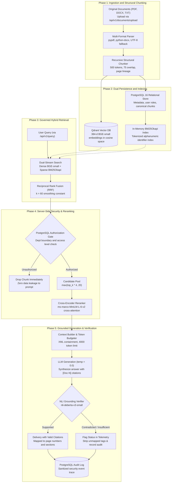

# Clario — Enterprise Knowledge Intelligence Platform

[](https://www.python.org/)
[](https://fastapi.tiangolo.com/)
[](https://react.dev/)
[](https://www.postgresql.org/)
[](https://qdrant.tech/)
[](https://huggingface.co/BAAI/bge-small-en-v1.5)
[](https://github.com/dorianbrown/rank_bm25)
[](https://huggingface.co/cross-encoder/ms-marco-MiniLM-L-6-v2)
[](https://opensource.org/licenses/MIT)

Clario is an enterprise knowledge intelligence and Retrieval-Augmented Generation (RAG) platform that allows authenticated employees to query company knowledge, enforce role and department access boundaries, and receive grounded answers backed by source citations and Natural Language Inference (NLI) verification. Built with FastAPI, PostgreSQL 16, Qdrant, and React 19, the platform combines dense vector search with lexical BM25 retrieval, applies Reciprocal Rank Fusion and cross-encoder reranking, and validates claim faithfulness before returning citations mapped directly to source document chunks.

---

## Design and Strengths

### System Workflow
The platform executes governed knowledge synthesis through a six-phase architecture orchestrated by FastAPI and PostgreSQL:



The execution phases operate as follows:
1. Multi-Format Ingestion and Validation: Ingests PDF, DOCX, and TXT files, validates binary magic bytes (`%PDF`, `PK\x03\x04`), sanitizes paths, and stores originals in `storage/documents/<uuid>/original.<ext>`.
2. Structural Recursive Chunking: Chunks text along linguistic separators (`\n\n` $\rightarrow$ `\n` $\rightarrow$ `. ` $\rightarrow$ `; ` $\rightarrow$ `, ` $\rightarrow$ ` `) targeting 500 tokens with 75-token overlap, preserving start page, end page, and section headers without slicing words.
3. Dual Persistence and Indexing: Stores canonical chunk text in PostgreSQL (`document_chunks`), batch-generates 384-d normalized embeddings with `BAAI/bge-small-en-v1.5`, indexes points in Qdrant (`clario_documents`), and synchronizes the in-memory BM25Okapi index.
4. Dual-Stream Hybrid Retrieval: Queries dense semantic vectors in Qdrant and sparse lexical tokens in BM25Okapi concurrently, merging candidate rankings via Reciprocal Rank Fusion ($k=60$).
5. Server-Side Authorization & Cross-Encoder Reranking: Hydrates chunks from PostgreSQL and filters candidates against user roles and department boundaries *before* candidate pooling. Authorized candidates are re-ordered via `cross-encoder/ms-marco-MiniLM-L-6-v2`.
6. Grounded Generation and NLI Verification: Assembles prompt within a 4,000-token budget, generates responses at temperature 0.0, audits claims using `cross-encoder/nli-deberta-v3-small`, resolves `[Doc-N]` citations to database chunk metadata, and records sanitized audit logs.

### Server-Side Security Authority & RBAC
The platform enforces security at the data hydration tier rather than treating the frontend or prompt instructions as security boundaries:
- Three Application Roles: Exactly three roles exist: `user`, `analyst`, `admin`. There is no Auditor role.
  - `user`: Accesses `public` documents, `internal` documents matching their department, and self-uploaded documents. Cannot access confidential documents or audit logs.
  - `analyst`: Accesses `public`, `internal`, and `confidential` documents within their department, global department-less documents, and audit logs. Cannot manage users.
  - `admin`: Unrestricted access across all company documents, departments, user roles, and audit trails.
- Server-Side Pre-Filtering: Unauthorized chunks are removed during server-side authorization filtering *before* reranking, context construction, and LLM generation. The frontend and prompt instructions are not security boundaries.

### Zero Data Leakage Invariant
Automated security unit tests in [tests/test_security_authorization.py](backend/tests/test_security_authorization.py) and [tests/test_conversations.py](backend/tests/test_conversations.py) verify that unauthenticated requests retrieve strictly 0 non-public chunks, cross-department queries yield 0 confidential matches, and 0 cross-user conversation sessions leak.

### Honest Audit
The project measures operational trade-offs rather than relying on unverified claims:
- Dense semantic embeddings alone can struggle with exact alphanumeric error codes and policy identifiers (`ERR-DB-504`, `POL-HR-2026-A`), whereas BM25 retrieves them at Rank #1. Conversely, BM25 misses semantic paraphrasing where dense embeddings succeed; hybrid retrieval with RRF is necessary to bridge both failure modes.
- Cross-encoder reranking improves candidate ordering but adds ~150ms cross-attention inference overhead.
- NLI claim verification provides factual auditing but introduces additional latency, bounded by a 20-pair candidate cap (`VERIFICATION_MAX_PAIRS = 20`).

---

## Results

### Benchmark Comparison across 6 Ground-Truth Evaluation Inquiries

| Metric / Capability | Lexical Baseline (BM25 Only) | Semantic Baseline (BGE-small Only) | Clario Hybrid (RRF k=60) | Stage 2 Reranked Hybrid | Verification Source |
| :--- | :--- | :--- | :--- | :--- | :--- |
| **Macro Precision@3** | 0.3333 | 0.3333 | 0.3333 | **>= 0.3000** | [backend/tests/test_hybrid_retrieval.py](backend/tests/test_hybrid_retrieval.py) |
| **Macro Recall@3** | 0.8333 | 0.8333 | 0.8333 | **>= 0.8000** | [backend/tests/test_hybrid_retrieval.py](backend/tests/test_hybrid_retrieval.py) |
| **Macro MRR (Mean Reciprocal Rank)** | 0.7500 | 0.8333 | 0.7500 | **>= 0.7500** | [backend/tests/test_reranking.py](backend/tests/test_reranking.py) |
| **Exact Code Retrieval (`ERR-DB-504`)** | 100% (Rank #1) | 0.00% (Missed) | **100% (Rank #1)** | **100% (Rank #1 via RRF)** | [backend/tests/test_hybrid_retrieval.py](backend/tests/test_hybrid_retrieval.py) |
| **Semantic Paraphrase Retrieval** | 0.00% (Missed) | 100% (Rank #1) | **100% (Rank #1)** | **100% (Rank #1 via RRF)** | [backend/tests/test_hybrid_retrieval.py](backend/tests/test_hybrid_retrieval.py) |
| **Factual NLI Verification Archetypes** | N/A | N/A | N/A | **8 / 8 Archetypes Verified** | [backend/tests/test_nli_verifier.py](backend/tests/test_nli_verifier.py) |
| **Data Leakage Invariant** | 0.00% Leakage | 0.00% Leakage | 0.00% Leakage | **0.00% (100% Filtered)** | [backend/tests/test_security_authorization.py](backend/tests/test_security_authorization.py) |
| **Safe Abstention on Empty Context** | N/A | N/A | N/A | **100% Deterministic Abstention** | [backend/tests/test_generation.py](backend/tests/test_generation.py) |
| **Test Suite Pass Rate** | N/A | N/A | N/A | **23 / 23 Test Modules** | [backend/tests/](backend/tests/) |

Hybrid search with RRF prevents single-retriever failure modes by ensuring technical codes and conceptual paraphrases both surface in the top ranks.

Evaluation queries represent 6 distinct archetypes: exact codes, exact policies, vocabulary mismatch, multi-target queries, conceptual paraphrases, and zero-match out-of-domain queries.

### Metric Details and Reproduction Notes
- Macro Retrieval Metrics: Precision@3 uses fixed cutoff $K=3$ as denominator. Zero-match queries default to $P@3=0.0$, $R@3=0.0$, and $MRR=0.0$, and are included across all macro averages.
- RRF Formulation: $RRF(d) = \sum_{r} \frac{1}{60 + \text{rank}_r(d)}$. Candidates found by both streams rank higher due to agreement count tie-breaking.
- Grounding Thresholds: Evaluated via `cross-encoder/nli-deberta-v3-small`. Claims require Entailment $\ge 0.65$ to be labeled `SUPPORTED`. Any claim with Contradiction $\ge 0.55$ forces answer status to `CONTRADICTED`.

---

## Known Limitations and Next Steps

1. In-memory BM25 index scale:
   - Reason: The BM25 index resides in application process memory and rebuilds from PostgreSQL on startup.
   - Next step: Migrate lexical indexing to Qdrant sparse vectors or a distributed OpenSearch cluster for horizontal scaling.
2. CPU NLI verification latency:
   - Reason: Running `cross-encoder/nli-deberta-v3-small` on CPU adds 300ms–800ms per query when evaluating 20 pairs.
   - Next step: Deploy NLI inference on dedicated GPU workers or keep verification opt-in via request parameters (`verify=true`).
3. Global 20-pair candidate cap in verification:
   - Reason: `VERIFICATION_MAX_PAIRS = 20` bounds latency, which can result in `INCOMPLETE_VERIFICATION` on lengthy answers.
   - Next step: Implement dynamic pair budgeting based on claim confidence scores.
4. Synchronous REST generation payload:
   - Reason: `/api/v1/query` returns complete JSON responses rather than streaming tokens.
   - Next step: Implement Server-Sent Events (SSE) in FastAPI for token-by-token streaming and real-time verification indicators.
5. OCR limitations on image-only PDFs:
   - Reason: Ingestion uses `pypdf` for native text streams and rejects scanned PDFs lacking extractable text.
   - Next step: Integrate an asynchronous Tesseract or PyMuPDF OCR pipeline.
6. Frontend conversational chat view:
   - Reason: The React 19 frontend currently implements documents management and identity health; chat view is scheduled for the next milestone.
   - Next step: Build a dedicated full-screen Knowledge Chat view with expandable citation drawers.
7. Cross-encoder runtime overhead:
   - Reason: Full cross-attention reranking adds ~150ms latency over first-stage bi-encoder cosine search.
   - Next step: Export `cross-encoder/ms-marco-MiniLM-L-6-v2` to ONNX Runtime with INT8 quantization.

### Real Execution Failure and Routing Examples
- Query `ERR-DB-504` (Semantic search blindspot): Pure semantic search failed to locate technical incident chunk `chunk_it_id` due to low embedding density on alphanumeric codes. Hybrid BM25 retrieved it at Rank #1, and RRF correctly placed it at Rank #1.
- Query `POL-HR-2026-A` by Unauthenticated User (Security override): An unauthenticated user queried internal leave policies. The retrieval pipeline hydrated the chunk, checked permissions, and dropped it immediately, returning zero context and forcing safe abstention.
- Hallucinated Citation Tag Sanitization: When generation produced an unsupplied tag `[Doc-99]`, `GenerationService` stripped the unmapped tag from public text and logged it in telemetry.

---

## Setup and Run

### Prerequisites
- Python 3.11+
- Node.js 18+ (for frontend console)
- Docker & Docker Compose
- Operating System: Linux, macOS, or Windows

### 1. Installation
```bash
git clone https://github.com/Jslxh/clario.git
cd clario
python3 -m venv backend/.venv
source backend/.venv/bin/activate    # On Windows: backend\.venv\Scripts\activate
pip install -r backend/requirements.txt
```

### 2. Environment Configuration
```bash
cp .env.example .env
```
Default parameters connect to local PostgreSQL (`localhost:5432`) and Qdrant (`localhost:6333`).

### 3. Start Storage Infrastructure
```bash
docker compose up -d
```
Starts `clario-postgres` (PostgreSQL 16) and `clario-qdrant` (Qdrant 1.10+).

### 4. Run Test Suite
```bash
cd backend
pytest
```
Executes all 23 test modules verifying parsers, chunking, embeddings, hybrid retrieval, reranking, NLI verification, and RBAC security.

### 5. Launch Backend REST Service
```bash
cd backend
uvicorn app.main:app --host 127.0.0.1 --port 8000 --reload
```
Key verified API endpoints:
- `POST /api/v1/auth/login`: Authenticate and receive JWT bearer token
- `POST /api/v1/documents/upload`: Upload original PDF, DOCX, or TXT document
- `POST /api/v1/documents/{id}/process`: Enqueue asynchronous parsing, chunking, and vector indexing
- `POST /api/v1/search`: Execute standalone hybrid, semantic, or BM25 document search
- `POST /api/v1/query`: Execute grounded question answering with citations and verification
- `GET /api/v1/audit-logs`: Inspect security audit events (Admin and Analyst only)

### 6. Launch Frontend
```bash
cd frontend
npm install
npm run dev
```
Open `http://localhost:5173` to access the Clario enterprise console for document uploads, processing inspection, and health telemetry.

### Deployment Note
PostgreSQL stores relational metadata and canonical chunks, while Qdrant persists 384-d vector embeddings in Docker volumes (`postgres_data`, `qdrant_data`).

---

## Roles, Retrieval Architecture, Tech Stack, Test Suite

### Roles & Permissions
- `user`: Knowledge Chat, search authorized documents, view citations and verification, manage owned conversations.
- `analyst`: All user capabilities, access confidential department documents, inspect audit logs via `/api/v1/audit-logs`.
- `admin`: Full unrestricted cross-department access, document upload/deletion, user and role administration, audit inspection.

### Retrieval & Verification Parameters
- Embedding Model: `BAAI/bge-small-en-v1.5`
- Embedding Dimension: 384
- Vector Database: Qdrant (`clario_documents`, Cosine similarity)
- Lexical Retrieval: BM25Okapi over canonical PostgreSQL chunks
- Fusion Algorithm: Reciprocal Rank Fusion ($k=60$)
- Reranker: `cross-encoder/ms-marco-MiniLM-L-6-v2`
- Grounding Verifier: `cross-encoder/nli-deberta-v3-small` (Entailment $\ge 0.65$, Contradiction $\ge 0.55$)

### Tech Stack
| Layer | Technology | Operational Function |
| :--- | :--- | :--- |
| **Language** | Python 3.11+ | Backend services and ML pipelines |
| **API** | FastAPI + Uvicorn | REST API with Pydantic v2 validation |
| **ORM & DB** | SQLAlchemy 2.x + PostgreSQL 16 | Relational metadata, user accounts, canonical chunks, audit logs |
| **Vector Store** | Qdrant 1.10+ | Dense vector indexing and similarity search |
| **Embeddings** | Sentence Transformers | Dense 384-d normalized embeddings (`bge-small-en-v1.5`) |
| **Lexical Retrieval** | rank_bm25 | BM25Okapi inverted index over canonical chunks |
| **Fusion** | Reciprocal Rank Fusion (RRF) | Hybrid rank fusion ($k=60$) |
| **Reranker** | Cross-Encoder | Candidate reranking (`ms-marco-MiniLM-L-6-v2`) |
| **NLI Verifier** | Cross-Encoder | Grounding verification (`nli-deberta-v3-small`) |
| **Frontend** | React 19 + Vite | Enterprise UI with Vanilla CSS design system |
| **Testing** | Pytest | Automated test runner |

### Test Suite
The repository includes 23 automated unit and integration test modules in `backend/tests/`:
```bash
pytest
```
Test coverage spans 15 core architectural categories:
- **Database & Health**: PostgreSQL schema, foreign keys, and Qdrant collection connectivity (`test_database.py`, `test_health.py`).
- **Ingestion & Parsers**: PDF, DOCX, and TXT parsing with Unicode and error handling (`test_parsers.py`, `test_documents.py`, `test_storage_backends.py`, `test_background_processing.py`).
- **Chunking**: Recursive structural chunking, headings, overlap, and token counters (`test_chunking.py`).
- **Embeddings & Vector Store**: BGE-small 384-d vectors, batching, and Qdrant upserts (`test_embeddings.py`).
- **Retrieval & Reranking**: Semantic search, BM25Okapi, RRF ($k=60$), and Cross-Encoder reranking (`test_retrieval.py`, `test_hybrid_retrieval.py`, `test_reranking.py`).
- **Context & Generation**: Token budgeting, XML boundary escaping, prompt injection containment, and LLM provider interfaces (`test_context_builder.py`, `test_generation.py`, `test_llm_provider.py`).
- **Grounding Verification**: Claim extraction, 8 NLI archetypes, pair caps, and verify toggles (`test_claim_extractor.py`, `test_nli_verifier.py`, `test_verification_integration.py`).
- **Conversations & RBAC**: Session CRUD, user isolation, follow-up query contextualization, and server-side authorization filtering (`test_conversations.py`, `test_conversation_followup.py`, `test_auth_and_rbac.py`, `test_security_authorization.py`).
- **Audit Logging**: Structured security event persistence and sensitive key scrubbing (`test_audit_service.py`).

---

## Documentation Links

- Product Requirements Document: [PRD.md](PRD.md)
- Interactive OpenAPI Documentation: `http://localhost:8000/docs`
- System Health Check: `http://localhost:8000/health`

---

## Repository Structure

```text
clario/
├── docker-compose.yml                 # PostgreSQL 16 and Qdrant 1.10 container orchestration
├── .env.example                       # Environment variable template
├── PRD.md                             # Comprehensive Product Requirements Document
├── README.md                          # Project documentation
│
├── docker/
│   └── README.md                      # Container health checks and operational notes
│
├── backend/                           # FastAPI backend service
│   ├── requirements.txt               # Locked Python dependencies
│   ├── alembic.ini                    # Alembic migration configuration
│   ├── alembic/                       # Schema version migrations
│   ├── app/
│   │   ├── main.py                    # Application entrypoint and CORS middleware
│   │   ├── core/                      # Configuration, security, database, and exceptions
│   │   ├── models/                    # SQLAlchemy models (User, Role, Document, Chunk, etc.)
│   │   ├── schemas/                   # Pydantic v2 schemas for requests and responses
│   │   ├── api/                       # API router registrations and dependencies
│   │   │   └── v1/                    # Health, auth, documents, search, query, audit
│   │   └── services/                  # Parsers, chunking, retrieval, reranking, NLI, generation
│   └── tests/                         # Pytest test suite (23 passing modules)
│
└── frontend/                          # React 19 + Vite operator console
    ├── index.html                     # Entry point
    ├── package.json                   # Dependencies
    ├── vite.config.js                 # Build configuration
    ├── src/
    │   ├── App.jsx                    # Root application component
    │   ├── context/                   # AuthContext with token management
    │   ├── components/                # Login, Register, Dashboard, DocumentTable
    │   └── pages/                     # Documents management workspace
    └── tests/
        └── document_management.test.js# API client unit tests
```

---

## License and Citations

- Platform: Clario (Enterprise Knowledge Intelligence Platform).
- License: MIT License.
